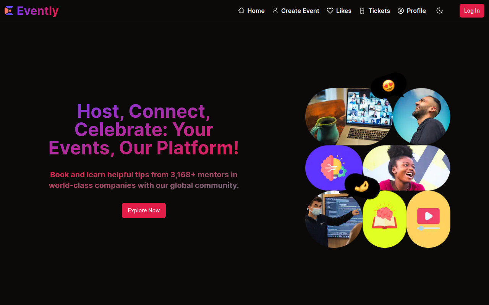
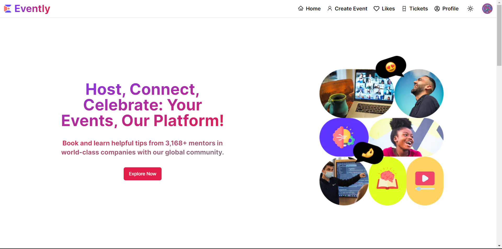
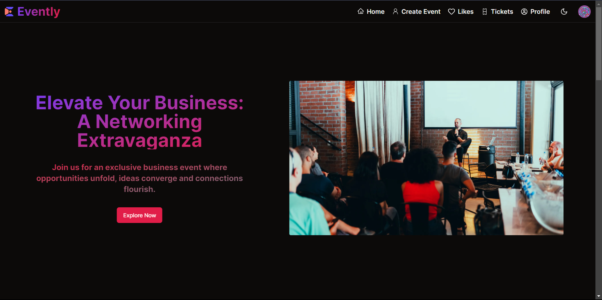
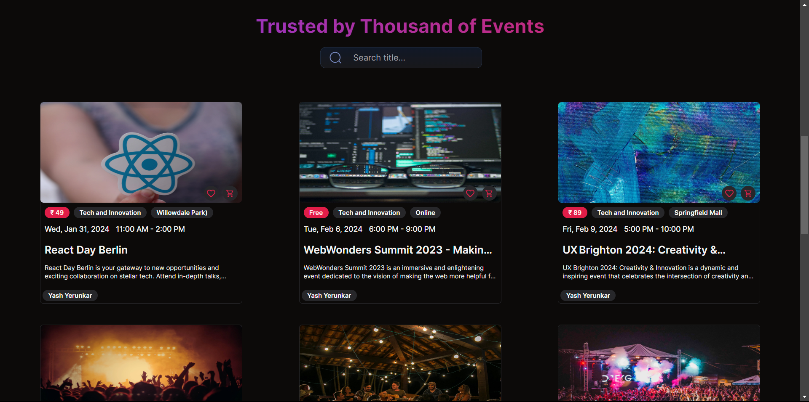
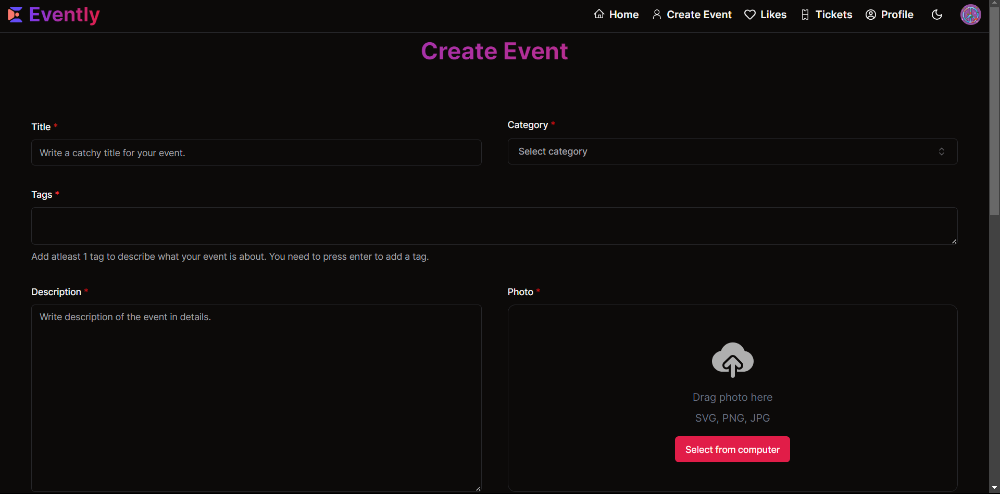
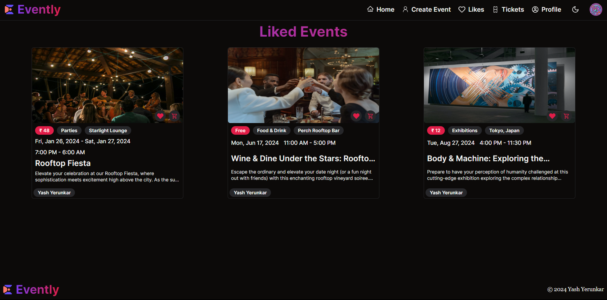
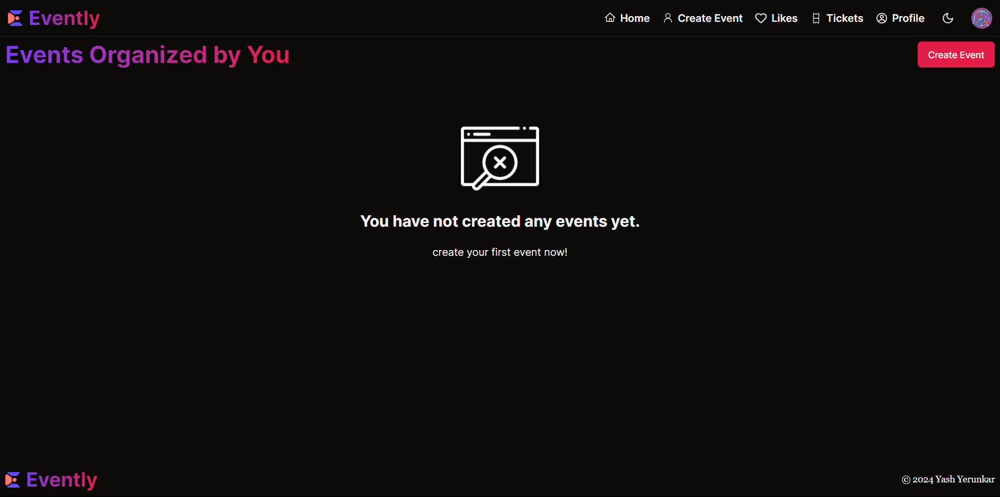

# Evently - Event Management Application

Built on Next.js 14, the events application stands as a comprehensive, full-stack platform for managing events. It serves as a hub, spotlighting diverse events taking place globally. Featuring seamless payment processing through Stripe, you have the capability to purchase tickets for any event or even initiate and manage your own events. The application also features a user authentication system. Users can create an account, log in and log out. The application also features a responsive user interface that adapts seamlessly to different screen sizes. The application is built with React, Next.js, Tailwind CSS and MongoDB. It is deployed with Vercel.

## Live

Explore Evently live: [Evently](https://evently-yy.vercel.app/)

## Features

- **Authentication with Clerk:** User management through Clerk, ensuring secure and efficient authentication.
- **Events (CRUD):** Comprehensive functionality for creating, reading, updating and deleting events, giving users full control over event management.
- **Related Events:** Smartly connects events that are related and displaying on the event details page, making it more engaging for users.
- **Organized Events:** Efficient organization of events, ensuring a structured and user-friendly display for the audience, i.e., showing events created by the user on the user profile.
- **Event Orders:** Comprehensive order management system, providing a clear overview of all event-related transactions.
- **Search & Filter:** Empowering users with a robust search and filter system, enabling them to easily find the events that match their preferences.
- **Checkout and Pay with Stripe:** Smooth and secure payment transactions using Stripe, enhancing user experience during the checkout process.
- **Multiple Layouts & Grouped Routes:** Explore a well-organized interface with various layout options and grouped routes for intuitive navigation.
- **Responsive UI:** Enjoy a responsive user interface that adapts seamlessly to different screen sizes.
- **Form Handling:** Efficiently handle forms for seamless user interactions.
- **Webhooks for Authentication Service:** Utilize webhooks for streamlined authentication and payment services.
- **Filter and Search Functionality:** Easily filter and search across pages for quick access to relevant content.
- **Pagination:** Navigate through content effortlessly with paginated views.
- **Loading UI:** Experience a user-friendly loading interface for improved responsiveness.
- **SEO Optimization:** Enhance discoverability.

and many more, including code architecture and reusability.

## Tech Stack

- **Next.js:** A React framework for building server-rendered applications.
- **TypeScript**: A typed superset of JavaScript that compiles to plain JavaScript.
- **Tailwind CSS:** A utility-first CSS framework for building responsive designs.
- **Shadcn UI:** Add visual appeal with the Shadcn UI component library.
- **Clerk:** A developer-first identity and user management service.
- **Stripe:** A payment processing platform for online businesses.
- **MongoDB:** Store and manage data with the MongoDB database.
- **Vercel:** Deploy and host your application with Vercel for seamless scalability.

## Screenshots

## Enjoy exploring Evently!
